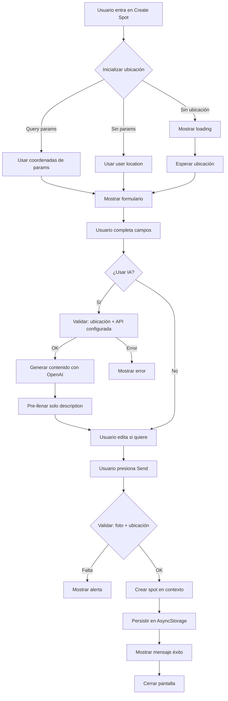
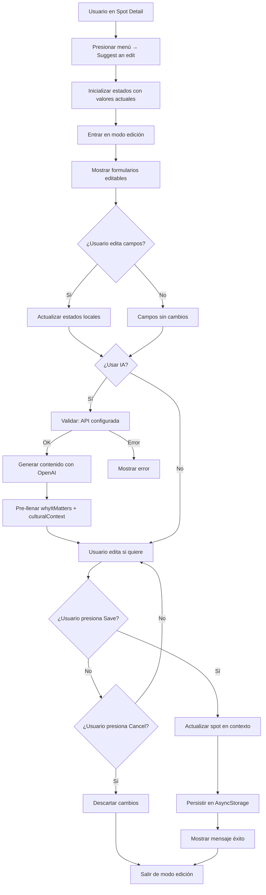

# Análisis del Estado Actual: Sistema de Creación y Edición de Spots

**Fecha:** 2024-12-20  
**Versión:** 1.0  
**Objetivo:** Documentación exhaustiva del estado actual del sistema de creación y edición de spots para identificar problemas y oportunidades de mejora.

---

## 1. Flujos Actuales

### 1.1. Flujo de Creación de Spots

#### Puntos de Entrada
1. **Long press en mapa** (`app/(tabs)/map.tsx`)
   - Captura coordenadas del punto presionado
   - Navegación a `/create-spot?lat=X&lng=Y`

2. **Botón "+" en mapa** (`app/(tabs)/map.tsx`)
   - Usa ubicación del usuario si está disponible
   - Fallback a ubicación por defecto (Lima, Perú)
   - Navegación a `/create-spot?lat=X&lng=Y`

3. **Desde búsqueda** (`app/(tabs)/search.tsx`)
   - Similar al botón "+" del mapa
   - Usa ubicación del usuario o fallback

#### Proceso de Creación (`app/create-spot.tsx`)



#### Campos en Creación
- **Foto** (requerido): Hook `useImageUpload` con optimización automática
- **Ubicación** (requerido): Búsqueda por dirección o ajuste en mapa
- **Nombre** (opcional): Input de texto simple
- **Descripción** (opcional): TextArea multiline
- **Tipo** (opcional, default: 'other'): Grid horizontal de botones

#### Generación con IA
- **Condiciones:** `isAIConfigured() === true` y `currentLocation !== null`
- **Campos generados:** `whyItMatters`, `culturalContext`, `howToVisit`, `narration`
- **Campos mostrados:** Solo `description` (pre-llenado con `whyItMatters`)
- **Problema:** Otros campos generados no se muestran ni se guardan

---

### 1.2. Flujo de Edición de Spots

#### Punto de Entrada
- **Spot Detail** → Menú (tres puntos) → "Suggest an edit"
- Inicializa todos los estados locales con valores actuales del spot

#### Proceso de Edición (`app/spot-detail.tsx`)



#### Campos Editables
- **Foto:** Botón "edit" sobre imagen o placeholder "Add photo"
- **Nombre:** TextInput
- **Tipo:** FlatList horizontal de botones
- **Why it Matters:** TextArea multiline (4 líneas) con botón AI
- **Cultural Context:** TextArea multiline (4 líneas)
- **Ubicación:** Inputs manuales (lat/lng) + mapa interactivo
- **How to Visit:** 2 tips con iconos seleccionables (pero valores hardcodeados en visualización)
- **Horarios:** 7 inputs (uno por día)
- **Costo:** 3 inputs (amount, currency, description)
- **Restrictions:** Input texto + icono seleccionable
- **Accessibility:** Input texto + icono seleccionable

#### Problemas Identificados
- `howToVisit` se genera pero no se lee de `spot.howToVisit` en visualización (valores hardcodeados)
- No hay preview de contenido generado antes de aplicar
- Cancelar descarta cambios inmediatamente sin confirmación
- Todos los campos avanzados se muestran juntos (sin progressive disclosure)

---

## 2. Inventario de Componentes

### 2.1. Componentes Canónicos Existentes (`components/ui/`)

| Componente | Uso Actual | Reutilización |
|------------|------------|---------------|
| `Chip` | Tags de tipo de spot | ✅ Alta |
| `ContentHeader` | Headers con hero (imagen/mapa) | ✅ Alta |
| `GlassView` | Contenedores con efecto glass | ✅ Muy alta |
| `Icon` | Iconografía consistente | ✅ Muy alta |
| `IconButton` | Botones de icono en headers | ✅ Alta |
| `InfoMeta` | Metadata (chip, distancia, rating) | ✅ Alta |
| `SectionHeader` | Encabezados de sección | ✅ Alta |
| `Toast` | Notificaciones discretas | ✅ Media |
| `Tooltip` | Información contextual | ✅ Media |

### 2.2. Componentes de Formulario NO Canónicos

**Problema:** Los formularios en `create-spot.tsx` y `spot-detail.tsx` usan componentes nativos directamente sin abstracción.

| Elemento | Ubicación | Uso | Debería ser |
|----------|-----------|-----|-------------|
| `TextInput` | create-spot.tsx, spot-detail.tsx | Inputs de texto | `FormTextInput` |
| `TextInput` (multiline) | create-spot.tsx, spot-detail.tsx | Textareas | `FormTextArea` |
| Selector de tipo | create-spot.tsx, spot-detail.tsx | Grid de tipos | `FormTypeSelector` |
| Selector de ubicación | create-spot.tsx, spot-detail.tsx | Mapa + búsqueda | `FormMapSelector` |
| Selector de imagen | create-spot.tsx, spot-detail.tsx | useImageUpload hook | `FormImagePicker` |
| Selector de iconos | spot-detail.tsx | Modal con grid | `FormIconSelector` |

### 2.3. Hooks Existentes

| Hook | Ubicación | Uso | Estado |
|------|-----------|-----|--------|
| `useImageUpload` | `hooks/useImageUpload.ts` | Optimización de imágenes | ✅ Canónico |
| `useColorScheme` | `hooks/use-color-scheme.ts` | Tema dark/light | ✅ Canónico |
| `useLocations` | `hooks/useLocations.ts` | Gestión de ubicación | ✅ Canónico |

**Falta:** Hook `useSpotForm` para abstraer lógica de formularios de spots.

---

## 3. Mapa de Dependencias

### 3.1. Dependencias de Creación/Edición

```
app/create-spot.tsx
├── contexts/SpotContext.tsx (createSpot)
├── hooks/useImageUpload.ts (optimización imágenes)
├── utils/aiConfig.ts (isAIConfigured)
├── utils/aiContentGenerator.ts (generateSpotContent)
├── components/MapView.tsx (FlowyaMapView)
├── components/ui/GlassView.tsx
├── components/ui/Icon.tsx
└── expo-location (geocoding, ubicación)

app/spot-detail.tsx
├── contexts/SpotContext.tsx (getSpotById, updateSpot, deleteSpot)
├── contexts/SavedContext.tsx (isSpotSaved, toggleSaveSpot)
├── contexts/FlowContext.tsx (startFlow)
├── contexts/PathContext.tsx (createPath)
├── hooks/useImageUpload.ts (optimización imágenes)
├── utils/aiConfig.ts (isAIConfigured)
├── utils/aiContentGenerator.ts (generateSpotContent)
├── components/MapView.tsx (FlowyaMapView)
├── components/ui/ContentHeader.tsx
├── components/ui/InfoMeta.tsx
├── components/ui/GlassView.tsx
└── expo-location (geocoding, ubicación)
```

### 3.2. Dependencias de OpenAI API

```
utils/aiContentGenerator.ts
├── utils/aiConfig.ts (configuración, validación, rate limiting)
├── data/spots.ts (tipos Spot, SpotType)
└── OpenAI API (fetch a api.openai.com)

contexts/SpotContext.tsx
├── utils/aiContentGenerator.ts (generateSpotContent)
└── AsyncStorage (persistencia)
```

### 3.3. Flujo de Datos OpenAI

```
Usuario presiona "AI"
  ↓
Validar isAIConfigured()
  ↓
Crear spot temporal con datos actuales
  ↓
detectMissingFields() → Campos a generar
  ↓
createPrompt() → Prompt específico
  ↓
callOpenAI() → Llamada a API
  ↓
Parsear JSON respuesta
  ↓
Combinar con contenido existente
  ↓
Pre-llenar campos en UI
  ↓
Usuario edita si desea
  ↓
Guardar spot actualizado
```

---

## 4. Problemas Identificados

### 4.1. Problemas de UX

#### Alta Prioridad
1. **Campos generados no visibles en creación**
   - `culturalContext`, `howToVisit`, `narration` se generan pero no se muestran
   - Solo `description` se pre-llena con `whyItMatters`

2. **How to Visit no se lee correctamente**
   - En visualización muestra valores hardcodeados
   - No lee de `spot.howToVisit`

3. **No hay preview de contenido generado**
   - Contenido se aplica directamente
   - No hay opción de aceptar/rechazar

#### Media Prioridad
4. **Falta progressive disclosure**
   - Todos los campos avanzados se muestran juntos
   - Deberían estar en secciones colapsables

5. **Cancelar sin confirmación**
   - Cambios se descartan inmediatamente
   - No hay advertencia si hay cambios sin guardar

6. **No hay control de regeneración**
   - No se puede forzar regeneración de campos existentes
   - No hay UI para seleccionar qué campos regenerar

### 4.2. Problemas de Arquitectura

#### Alta Prioridad
1. **Componentes de formulario no canónicos**
   - Lógica duplicada entre create-spot.tsx y spot-detail.tsx
   - No hay abstracción de campos de formulario

2. **Gestión de estado dispersa**
   - Estados locales en pantallas en lugar de hooks reutilizables
   - Validaciones mezcladas con lógica de UI

#### Media Prioridad
3. **Validación inconsistente**
   - Validaciones en diferentes lugares
   - No hay validación centralizada

4. **Código duplicado**
   - Lógica similar en creación y edición
   - Selectores de tipo, iconos, etc. duplicados

### 4.3. Problemas de Integración OpenAI

1. **Rate limiting básico**
   - Solo client-side (2 segundos mínimo)
   - No previene múltiples usuarios
   - No hay límite diario/mensual

2. **Manejo de errores limitado**
   - No hay fallback automático
   - Usuario debe intentar de nuevo manualmente

3. **Sin cache**
   - Se regenera contenido aunque ya exista
   - No hay invalidación de cache

### 4.4. Preparación para Narración

1. **Narration se genera pero no se usa**
   - Campo `narration` se genera pero no está integrado con NarrationContext
   - No hay flujo claro desde generación hasta uso en Flow

2. **Falta conexión**
   - No hay integración entre `utils/aiContentGenerator.ts` y `utils/narrationGenerator.ts`
   - Narraciones generadas no se usan en Flow activo

---

## 5. Oportunidades de Mejora

### 5.1. Componentes Canónicos Propuestos

1. **FormField** - Campo base con label, input y mensaje de error
2. **FormTextInput** - Input de texto con estados y validación
3. **FormTextArea** - Textarea multiline con estados
4. **FormMapSelector** - Selector de ubicación con mapa interactivo
5. **FormImagePicker** - Selector de imagen con optimización automática
6. **FormTypeSelector** - Grid horizontal de tipos de spot
7. **FormIconSelector** - Selector de iconos (extraer de modal existente)
8. **AIContentPreview** - Preview de contenido generado por IA
9. **AIGenerateButton** - Botón con estados de generación IA

### 5.2. Hook Propuesto

**useSpotForm** - Hook que maneja:
- Estados de todos los campos del spot
- Validaciones
- Optimización de imágenes
- Integración con OpenAI API
- Guardado/cancelación

### 5.3. Mejoras de UX Propuestas

1. **Progressive disclosure** en creación y edición
2. **Preview de contenido** antes de aplicar
3. **Confirmación al cancelar** si hay cambios
4. **Regeneración selectiva** de campos con IA
5. **Mejor organización** de campos en secciones colapsables

---

## 6. Deuda Técnica

### 6.1. Código Duplicado
- Lógica de formularios entre create-spot.tsx y spot-detail.tsx
- Selectores de tipo duplicados
- Validaciones duplicadas

### 6.2. Falta de Abstracción
- Campos de formulario no canónicos
- Gestión de estado no centralizada
- Validaciones no centralizadas

### 6.3. Integraciones Incompletas
- Narraciones generadas no se usan
- Campos generados no se muestran todos
- Rate limiting básico

---

## 7. Métricas Actuales

### 7.1. Complejidad de Código
- `create-spot.tsx`: ~720 líneas
- `spot-detail.tsx`: ~1517 líneas
- Lógica duplicada estimada: ~40%

### 7.2. Componentes Reutilizables
- Componentes canónicos existentes: 9
- Componentes de formulario canónicos: 0
- Oportunidad de creación: 9 componentes nuevos

### 7.3. Integración OpenAI
- Campos generados: 4 (whyItMatters, culturalContext, howToVisit, narration)
- Campos mostrados en creación: 1 (description)
- Campos mostrados en edición: 2 (whyItMatters, culturalContext)
- Campos no visibles: 2 (howToVisit parcial, narration completo)

---

## 8. Conclusiones

### Estado Actual
El sistema de creación y edición de spots está **funcional pero tiene oportunidades significativas de mejora** en:
- UX (progressive disclosure, preview, confirmaciones)
- Arquitectura (componentes canónicos, hooks reutilizables)
- Integración OpenAI (mostrar todos los campos, preview, regeneración)
- Preparación para narración (conectar generación con uso)

### Prioridades
1. **Alta:** Componentes canónicos de formulario
2. **Alta:** Hook useSpotForm
3. **Media:** Mejoras de UX (progressive disclosure, preview)
4. **Media:** Mejor integración OpenAI
5. **Baja:** Preparación para narración (no bloqueante)

### Próximos Pasos
Seguir el plan por scopes para abordar estos problemas de forma ordenada y controlada.

---

**Documento generado:** 2024-12-20  
**Versión del Proyecto:** FLOWYA V1.0  
**Última actualización:** Análisis completo del estado actual del sistema de creación y edición de spots
