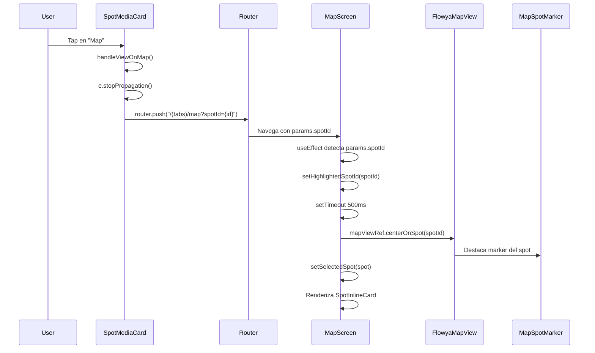

# Análisis Funcional: Acción "Map" en SpotMediaCard

**Fecha:** 2024-12-20  
**Versión:** 1.0  
**Objetivo:** Documentación exhaustiva del comportamiento de la acción "Map" en SpotMediaCard y su interacción con la sección Map.

---

## Resumen Ejecutivo

La acción "Map" en el componente `SpotMediaCard` permite navegar directamente a la pantalla Map centrando el mapa en el spot seleccionado y mostrando su card de información. Este análisis describe el comportamiento completo de esta funcionalidad y cómo interactúa con la sección Map.

## Flujo Completo de Interacción



## 1. Componente: SpotMediaCard

### 1.1 Ubicación del Código

- **Archivo**: `components/SpotMediaCard.tsx`
- **Handler**: `handleViewOnMap` (líneas 94-97)
- **Render**: `renderDistanceWithViewOnMap` (líneas 100-139)

### 1.2 Handler Principal

```typescript
const handleViewOnMap = useCallback((e: GestureResponderEvent) => {
  e.stopPropagation(); // Prevenir que el card se abra
  router.push(`/(tabs)/map?spotId=${spot.id}`);
}, [spot.id, router]);
```

**Comportamiento**:
1. **Prevención de propagación**: `e.stopPropagation()` evita que se ejecute el `onPress` del card padre
2. **Navegación**: Usa `router.push()` para navegar a la pantalla Map con `spotId` como query parameter

### 1.3 Renderizado Visual

El texto "Map" se muestra inline con la distancia:

```typescript
<View style={styles.distanceRow}>
  <InfoMeta distance={distance} ... />
  <Text>·</Text>
  <TouchableOpacity onPress={handleViewOnMap}>
    <Text style={styles.mapText}>Map</Text>
  </TouchableOpacity>
</View>
```

**Características visuales**:
- Tamaño idéntico al texto de distancia (`fontSize.sm`)
- Color `colors.tint` (color de acento de la app)
- Alineación óptica con `paddingTop: 10` para alinear baseline
- Separador "·" entre distancia y "Map"
- Solo visible si hay `distance` definida

## 2. Recepción en MapScreen

### 2.1 Archivo: `app/(tabs)/map.tsx`

### 2.2 Lectura del Parámetro

```typescript
const params = useLocalSearchParams<{ spotId?: string }>();
const [highlightedSpotId, setHighlightedSpotId] = useState<string | undefined>(params.spotId);
```

**Estado inicial**: Si hay `spotId` en los params, se establece como `highlightedSpotId` inicial.

### 2.3 Efecto de Centrado y Destacado

```typescript
useEffect(() => {
  if (!params.spotId || spotsLoading) {
    return;
  }

  const spot = spots.find(s => s.id === params.spotId);
  if (!spot) {
    console.warn(`MapScreen: Spot with id ${params.spotId} not found`);
    return;
  }

  // 1. Establecer highlightedSpotId para que el mapa lo muestre destacado
  setHighlightedSpotId(params.spotId);

  // 2. Delay de 500ms para asegurar que el mapa esté listo
  const timer = setTimeout(() => {
    if (mapViewRef.current) {
      mapViewRef.current.centerOnSpot(params.spotId!);
    }
    // 3. Establecer spot seleccionado para mostrar card
    const spot = spots.find(s => s.id === params.spotId);
    if (spot) {
      setSelectedSpot(spot);
    }
  }, 500);

  return () => clearTimeout(timer);
}, [params.spotId, spots, spotsLoading]);
```

**Pasos del proceso**:

1. **Validación**: Verifica que exista `params.spotId` y que los spots estén cargados
2. **Búsqueda**: Busca el spot en el array de spots usando el ID
3. **Highlight**: Establece `highlightedSpotId` para que el mapa muestre el marker destacado
4. **Centrado**: Después de 500ms (para asegurar que el mapa esté listo), llama a `centerOnSpot(spotId)`
5. **Selección**: Establece `selectedSpot` para mostrar el card flotante

### 2.4 Limpieza de Selección

```typescript
useEffect(() => {
  if (!params.spotId) {
    setSelectedSpot(null);
  }
}, [params.spotId]);
```

**Comportamiento**: Si el `params.spotId` desaparece (usuario navega a otra pantalla), limpia la selección.

## 3. Comportamiento del Mapa

### 3.1 FlowyaMapView

El mapa recibe `highlightedSpotId` como prop:

```typescript
<FlowyaMapView
  ref={mapViewRef}
  spots={spots}
  highlightedSpotId={highlightedSpotId}
  ...
/>
```

**Efectos**:
1. El marker del spot con `highlightedSpotId` se muestra destacado (tooltip, estilo especial)
2. El método `centerOnSpot(spotId)` centra la cámara del mapa en las coordenadas del spot

### 3.2 Card Flotante (SpotInlineCard)

Cuando hay un `selectedSpot`, se muestra un card flotante:

```typescript
{selectedSpot && (
  <>
    <TouchableOpacity
      style={[StyleSheet.absoluteFillObject, styles.backdrop]}
      onPress={() => setSelectedSpot(null)}
    />
    <View style={styles.selectedSpotCardContainer}>
      <SpotInlineCard
        spot={selectedSpot}
        state="default"
        distance={selectedSpotDistance}
        onPress={() => handleSpotCardPress(selectedSpot)}
      />
    </View>
  </>
)}
```

**Características**:
- **Posición**: Flotante, posicionado arriba de los controles izquierdos
- **Backdrop**: Área táctil transparente para cerrar el card al tocar fuera
- **Acción**: Tap en el card navega a `SpotDetail`

## 4. Estados y Transiciones

### 4.1 Estados en MapScreen

1. **Estado inicial**:
   - `highlightedSpotId: undefined`
   - `selectedSpot: null`

2. **Al recibir `spotId` en params**:
   - `highlightedSpotId: params.spotId`
   - Mapa muestra el marker destacado

3. **Después del centrado (500ms)**:
   - `selectedSpot: spot`
   - Se muestra `SpotInlineCard` flotante

4. **Al limpiar**:
   - Si `params.spotId` desaparece → `selectedSpot: null`

### 4.2 Transiciones Visuales

- **Navegación**: Transición suave entre pantallas (expo-router)
- **Centrado del mapa**: Animación `flyTo` en Mapbox (500ms de duración)
- **Card flotante**: Aparece después del centrado

## 5. Características Técnicas

### 5.1 Prevención de Propagación

```typescript
e.stopPropagation(); // En handleViewOnMap
```

**Razón**: Evita que el `Pressable` del card ejecute su `onPress` (que normalmente navegaría a `SpotDetail`).

### 5.2 Delay de 500ms

```typescript
setTimeout(() => {
  mapViewRef.current.centerOnSpot(params.spotId!);
}, 500);
```

**Razón**: Asegurar que el mapa esté completamente montado y listo antes de centrar.

### 5.3 Memoización

```typescript
const handleViewOnMap = useCallback((e: GestureResponderEvent) => {
  // ...
}, [spot.id, router]);
```

**Razón**: Optimizar re-renders del componente.

## 6. Flujo de Usuario Completo

1. **Usuario ve un SpotMediaCard** con distancia calculada
2. **Ve el texto "Map"** inline con la distancia (ej: "📍 570 m · Map")
3. **Toca "Map"**
4. **Navega a la pantalla Map** (transición suave)
5. **El mapa se centra en el spot** (después de 500ms, animación flyTo)
6. **El marker del spot aparece destacado** (tooltip, estilo especial)
7. **Se muestra SpotInlineCard** con información del spot
8. **Usuario puede**:
   - Tocar el card → Navega a `SpotDetail`
   - Tocar fuera del card → Cierra el card
   - Interactuar con el mapa normalmente

## 7. Dependencias y Contextos

### 7.1 Dependencias Directas

- `expo-router`: Para navegación con query params
- `useLocalSearchParams`: Para leer `spotId` de la URL
- `FlowyaMapView`: Componente de mapa con métodos imperativos
- `SpotContext`: Para obtener datos de spots
- `useSpotDistance`: Para calcular distancia del spot seleccionado

### 7.2 Contextos Utilizados

- `SpotContext`: Proporciona `spots` array y métodos de búsqueda
- `OverlayContext`: Controla visibilidad del TabBar
- `useBaseLocation`: Ubicación del usuario para calcular distancias

## 8. Casos Edge y Manejo de Errores

### 8.1 Spot No Encontrado

```typescript
const spot = spots.find(s => s.id === params.spotId);
if (!spot) {
  console.warn(`MapScreen: Spot with id ${params.spotId} not found`);
  return;
}
```

**Comportamiento**: Si el spot no existe, se registra un warning y no se ejecuta ninguna acción.

### 8.2 Spots Cargando

```typescript
if (!params.spotId || spotsLoading) {
  return;
}
```

**Comportamiento**: Espera a que los spots estén cargados antes de procesar el `spotId`.

### 8.3 Mapa No Listo

El delay de 500ms ayuda a asegurar que el mapa esté listo, pero si el ref aún no está disponible, `centerOnSpot` simplemente no se ejecuta (verificación con `if (mapViewRef.current)`).

## 9. Resumen del Comportamiento

La función "Map" en `SpotMediaCard`:

1. ✅ **Navega a Map** con `spotId` como query parameter
2. ✅ **MapScreen detecta el parámetro** y destaca el spot
3. ✅ **Centra el mapa** en el spot (con delay para asegurar que el mapa esté listo)
4. ✅ **Muestra card flotante** con información del spot
5. ✅ **Permite navegar a SpotDetail** desde el card

Todo el flujo está completamente implementado y funcional.

## 10. Archivos Relacionados

- `components/SpotMediaCard.tsx` - Componente origen
- `app/(tabs)/map.tsx` - Pantalla destino
- `components/MapView.tsx` - Componente de mapa (FlowyaMapView)
- `components/MapboxView.tsx` - Implementación móvil
- `components/MapboxViewWeb.tsx` - Implementación web
- `components/MapSpotMarker.tsx` - Marker del spot en el mapa
- `components/SpotInlineCard.tsx` - Card flotante mostrado

## 11. Notas de Implementación

- El delay de 500ms es necesario porque el mapa necesita tiempo para montarse completamente
- El `highlightedSpotId` se establece antes del centrado para que el marker ya esté destacado cuando se centra
- El `selectedSpot` se establece después del centrado para que el card aparezca cuando el mapa ya está centrado
- La limpieza de `selectedSpot` cuando desaparece `params.spotId` asegura que no queden cards flotantes cuando el usuario navega a otra pantalla

---

**Documento generado:** 2024-12-20  
**Versión del Proyecto:** FLOWYA V1.0  
**Última actualización:** Análisis funcional completo de la acción "Map" en SpotMediaCard
