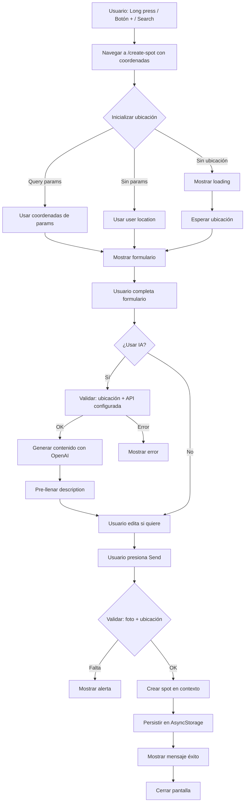
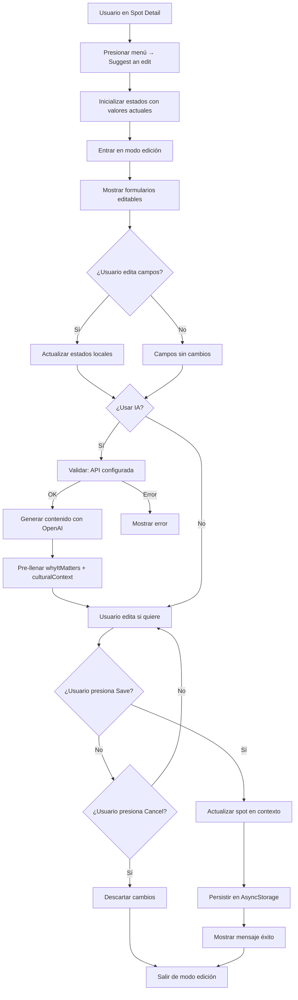

# Análisis Funcional: Creación y Edición de Spots en FLOWYA

## Resumen Ejecutivo

### Funcionalidades Principales

1. **Creación de Spots:** Permite crear nuevos lugares desde múltiples puntos de entrada
2. **Edición de Spots:** Permite editar spots existentes con permisos
3. **Integración con IA:** Generación automática de contenido contemplativo
4. **Edición Manual:** Control total sobre todos los campos
5. **Optimización Automática:** Imágenes optimizadas antes de guardar
6. **Persistencia Local:** Guardado automático en AsyncStorage

### Puntos de Entrada

**Creación:**
- Long press en mapa (`app/(tabs)/map.tsx` línea 120)
- Botón "+" en mapa (`app/(tabs)/map.tsx` línea 125)
- Desde búsqueda (`app/(tabs)/search.tsx` línea 184)

**Edición:**
- Menú en Spot Detail → "Suggest an edit" (`app/spot-detail.tsx` línea 266)

---

## 1. Flujo de Creación de Spots

### 1.1. Puntos de Entrada

#### A. Long Press en Mapa

**Archivo:** `app/(tabs)/map.tsx` (líneas 119-122)

**Comportamiento:**
```typescript
const handleMapLongPress = (location: { latitude: number; longitude: number }) => {
  router.push(`/create-spot?lat=${location.latitude}&lng=${location.longitude}`);
};
```

**Flujo:**
1. Usuario hace long press en cualquier punto del mapa
2. Se capturan coordenadas del punto presionado
3. Navegación a `/create-spot` con coordenadas en query params
4. Pantalla de creación se inicializa con esas coordenadas

#### B. Botón "+" en Mapa

**Archivo:** `app/(tabs)/map.tsx` (líneas 124-132)

**Comportamiento:**
```typescript
const handleCreateSpotPress = () => {
  const location = userLocation || {
    latitude: -12.0464,  // Default (Lima, Perú)
    longitude: -77.0428,
  };
  router.push(`/create-spot?lat=${location.latitude}&lng=${location.longitude}`);
};
```

**Flujo:**
1. Usuario presiona botón "+"
2. Se usa ubicación del usuario si está disponible
3. Si no hay ubicación, usa ubicación por defecto
4. Navegación a `/create-spot` con coordenadas

#### C. Desde Búsqueda

**Archivo:** `app/(tabs)/search.tsx` (líneas 184-190)

**Comportamiento:**
```typescript
const handleCreateSpotFromSearch = () => {
  const location = userLocation || {
    latitude: -12.0464,
    longitude: -77.0428,
  };
  router.push(`/create-spot?lat=${location.latitude}&lng=${location.longitude}`);
};
```

**Flujo:**
1. Usuario presiona botón de crear desde búsqueda
2. Similar al botón "+" del mapa

### 1.2. Inicialización de la Pantalla de Creación

**Archivo:** `app/create-spot.tsx` (líneas 102-140)

**Proceso de Inicialización:**

```typescript
useEffect(() => {
  // 1. Obtener ubicación del usuario
  const userLocation = await Location.getCurrentPositionAsync();
  setUserLocation(userLocation);
  
  // 2. Inicializar currentLocation desde:
  //    - Query params (si vienen de long press o botón)
  //    - User location (fallback)
  if (params.lat && params.lng) {
    setCurrentLocation({
      latitude: parseFloat(params.lat),
      longitude: parseFloat(params.lng),
    });
  } else {
    // Fallback a user location
    setCurrentLocation(userLocation);
  }
}, [params.lat, params.lng]);
```

**Estados Iniciales:**
- `name`: '' (vacío)
- `description`: '' (vacío)
- `type`: 'other' (por defecto)
- `currentLocation`: Desde query params o user location
- `userLocation`: Ubicación actual del usuario
- `photo`: null
- `isGeneratingAI`: false
- `aiError`: null

**Pantalla de Carga:**
Si no hay `currentLocation` ni `userLocation`, muestra:
- Spinner de carga
- Mensaje "Loading location..."
- Botón de cancelar

### 1.3. Formulario de Creación - Campos

#### Campo 1: Foto (Requerido)

**Ubicación:** Líneas 343-374

**Comportamiento:**
- **Estado inicial:** Placeholder con icono "add" y texto "Add photo"
- **Al presionar:** Abre selector de galería (hook `useImageUpload`)
- **Optimización automática:**
  - Redimensiona a max 1200px (mobile) o 1600px (web)
  - Comprime a calidad 75%
  - Remueve metadata
  - Muestra `ActivityIndicator` durante optimización
- **Después de seleccionar:**
  - Muestra imagen optimizada
  - Botón "X" para remover (línea 356-361)
- **Validación:** Campo requerido (línea 239-242)

**Hook usado:** `useImageUpload` (líneas 82-99)
- `allowsEditing: true` - Permite recortar
- `aspect: [4, 3]` - Aspect ratio fijo
- `quality: 75` - Calidad de compresión

#### Campo 2: Ubicación (Requerido)

**Ubicación:** Líneas 376-442

**Sub-campos:**

**A. Búsqueda por Dirección (Líneas 385-409)**
- Input de texto para buscar dirección
- Botón de búsqueda (icono search)
- Al buscar: Llama a `Location.geocodeAsync(addressSearch)`
- Si encuentra: Actualiza `currentLocation` con coordenadas
- Si no encuentra: Alerta "Not found"
- Muestra `ActivityIndicator` durante búsqueda

**B. Mapa Interactivo (Líneas 412-441)**
- Muestra mapa con pin en `currentLocation`
- Long press en mapa: Actualiza `currentLocation` (línea 426)
- Muestra coordenadas debajo del mapa (línea 437-439)
- Formato: `lat, lng` con 6 decimales

**Validación:** Campo requerido (línea 234-237)

#### Campo 3: Nombre (Opcional)

**Ubicación:** Líneas 445-456

**Comportamiento:**
- Input de texto simple
- Placeholder: "e.g. Main Square, Sunset Viewpoint..."
- Sin validación (opcional)
- Se guarda como `name` o `undefined` si está vacío

#### Campo 4: Descripción (Opcional)

**Ubicación:** Líneas 458-475

**Comportamiento:**
- TextArea multiline (3 líneas)
- Placeholder: "Brief description. e.g. A viewpoint with panoramic city views..."
- Sin validación (opcional)
- **Integración con IA:** Si se genera contenido con IA, se pre-llena aquí con `whyItMatters` (línea 207-209)

#### Campo 5: Tipo (Opcional, default: 'other')

**Ubicación:** Líneas 477-505

**Tipos Disponibles:**
```typescript
const SPOT_TYPES: SpotType[] = [
  'beach', 'cafe', 'viewpoint', 'museum', 
  'restaurant', 'park', 'monument', 'market', 'other'
];
```

**Comportamiento:**
- Grid horizontal de botones
- Un botón por tipo
- Botón seleccionado: Fondo con color tint + borde
- Botón no seleccionado: Fondo gris claro, sin borde
- Default: 'other'
- Sin validación

### 1.4. Generación con IA en Creación

**Ubicación:** Líneas 172-220

**Condiciones para Mostrar Botón AI:**
- `isAIConfigured() === true` (API key configurada)
- `currentLocation !== null` (hay ubicación seleccionada)

**Ubicación del Botón:** Líneas 518-544 (barra de acciones inferior)

**Flujo de Generación:**

```typescript
const handleGenerateAI = async () => {
  // 1. Validar ubicación
  if (!currentLocation) {
    Alert.alert('Error', 'Location is required to generate content');
    return;
  }

  // 2. Validar configuración
  if (!isAIConfigured()) {
    Alert.alert('AI not configured', 'OpenAI API key is not configured. Please set EXPO_PUBLIC_OPENAI_API_KEY in .env');
    return;
  }

  // 3. Estado de carga
  setIsGeneratingAI(true);
  setAiError(null);

  // 4. Crear spot temporal con datos actuales
  const tempSpot: Spot = {
    id: 'temp',
    name: name || undefined,
    location: currentLocation,
    photos: photo ? [photo] : [],
    description: description || undefined,
    type,
    // ... otros campos
  };

  // 5. Generar contenido
  const generatedContent = await generateSpotContent(tempSpot);

  // 6. Pre-llenar solo description con whyItMatters
  if (generatedContent.whyItMatters && !description) {
    setDescription(generatedContent.whyItMatters);
  }

  // 7. Mensaje de éxito
  Alert.alert('Content generated', 'Edit before creating.');
};
```

**Campos Generados pero No Usados:**
- `culturalContext` - Se genera pero no se muestra en Create Spot
- `howToVisit` - Se genera pero no se muestra en Create Spot
- `narration` - Se genera pero no se muestra en Create Spot

**Feedback Visual:**
- **Normal:** Botón "AI" con icono estrella y texto
- **Generando:** `ActivityIndicator` en lugar de icono
- **Error:** Mensaje en contenedor bajo botones (líneas 561-565)

### 1.5. Validaciones en Creación

**Archivo:** `app/create-spot.tsx` (líneas 229-242)

**Validación en Tiempo Real:**
```typescript
const isFormValid = currentLocation && photo;
```

**Validaciones al Enviar:**
```typescript
const handleSend = () => {
  // Validación 1: Ubicación requerida
  if (!currentLocation) {
    Alert.alert('Location required', 'Select a location on the map or search for an address');
    return;
  }

  // Validación 2: Foto requerida
  if (!photo) {
    Alert.alert('Photo required', 'Add a photo of the place');
    return;
  }

  // Si pasa validaciones, crear spot
  // ...
};
```

**Estados del Botón "Send":**
- **Habilitado:** `isFormValid === true` (verde/tint)
- **Deshabilitado:** `isFormValid === false` (gris, opacidad reducida)

### 1.6. Persistencia en Creación

**Archivo:** `contexts/SpotContext.tsx` (líneas 112-124)

**Proceso de Creación:**

```typescript
const createSpot = (spotData: Omit<Spot, 'id' | 'createdAt' | 'updatedAt'>): Spot => {
  const now = new Date();
  const newSpot: Spot = {
    ...spotData,
    id: `spot-${Date.now()}-${Math.random().toString(36).substr(2, 9)}`,
    createdBy: user?.id,  // ID del usuario autenticado
    createdAt: now,
    updatedAt: now,
  };

  setSpots((prev) => [...prev, newSpot]);
  return newSpot;
};
```

**Persistencia Automática:**
- `useEffect` en SpotContext (líneas 47-51) guarda automáticamente en AsyncStorage cuando `spots` cambia
- Key de storage: `@flowya_spots`
- Formato: JSON stringificado

**Mensaje de Éxito:**
- Líneas 275-299: Modal de éxito con mensaje "Thanks for sharing"
- Se muestra 2 segundos antes de cerrar
- Auto-cierre después de 2 segundos

---

## 2. Flujo de Edición de Spots

### 2.1. Punto de Entrada

**Archivo:** `app/spot-detail.tsx` (líneas 266-288)

**Acceso:**
1. Usuario navega a Spot Detail
2. Presiona menú (tres puntos) en header
3. Selecciona "Suggest an edit"
4. Entra en modo edición

**Función `handleSuggestEdit()`:**
```typescript
const handleSuggestEdit = () => {
  // Inicializar todos los estados de edición con valores actuales del spot
  setEditName(spot.name || '');
  setEditDescription(spot.description || '');
  setEditWhyItMatters(spot.whyItMatters || spot.description || '');
  setEditType(spot.type);
  setEditCulturalContext(spot.culturalContext || '');
  setEditLocation({ latitude: spot.location.latitude, longitude: spot.location.longitude });
  setEditHours(spot.hours);
  setEditCost(spot.cost);
  setEditRestrictions(spot.restrictions || 'No pets');
  setEditAccessibility(spot.accessibility || 'Unknown');
  // ... más campos
  setIsEditMode(true);
};
```

### 2.2. Modo Edición vs Modo Visualización

**Toggle de Modo:**
- `isEditMode: boolean` - Controla qué se muestra

**Cambios en UI cuando `isEditMode === true`:**

1. **Header:**
   - Botón izquierdo: "close" (en lugar de "back")
   - Botones derechos: Ocultos (bookmark, share, menu)

2. **Imagen:**
   - Botón "edit" sobre imagen (líneas 560-567)
   - Si no hay imagen: Placeholder con botón "Add photo"

3. **Campos de Texto:**
   - `Text` → `TextInput` (editable)
   - Placeholders con ejemplos
   - Bordes y estilos de input

4. **Tipo:**
   - `InfoMeta` chip → `FlatList` horizontal de botones seleccionables

5. **Botones de Acción:**
   - Barra inferior con "Cancel" y "Save" (líneas 1040-1055)
   - Oculto en modo visualización

### 2.3. Campos Editables en Edición

#### Campo 1: Foto

**Ubicación:** Líneas 530-569

**Comportamiento:**
- **Si hay imagen:** Botón "edit" sobre imagen
- **Si no hay imagen:** Placeholder con botón "Add photo"
- **Al presionar:** Abre selector (mismo hook `useImageUpload`)
- **Optimización:** Igual que en creación
- **Estado:** `isOptimizingImage` muestra overlay con spinner

**Hook con Initial URI:**
```typescript
const { uri: editPhoto, ... } = useImageUpload({
  initialUri: isEditMode && spot?.photos?.[0] ? getValidImage(spot.photos) : null,
  // ... otras opciones
});
```

#### Campo 2: Nombre

**Ubicación:** Líneas 574-581

**Comportamiento:**
- `TextInput` en modo edición
- `Text` en modo visualización
- Sin validación (opcional)

#### Campo 3: Tipo

**Ubicación:** Líneas 591-616

**Comportamiento:**
- `FlatList` horizontal de botones
- Mismo comportamiento que en creación
- Visual feedback al seleccionar

#### Campo 4: Why it Matters

**Ubicación:** Líneas 658-704

**Comportamiento:**
- `TextInput` multiline (4 líneas) en edición
- `Text` en visualización
- **Botón AI:** Visible solo en modo edición (líneas 664-683)
- Sincronización: `editWhyItMatters` y `editDescription` se mantienen sincronizados (línea 691)

**Botón AI:**
- Pequeño, junto al título
- Tooltip: "Generate description with AI"
- Mismo comportamiento que en creación

#### Campo 5: Cultural Context

**Ubicación:** Líneas 706-730

**Comportamiento:**
- `TextInput` multiline (4 líneas) en edición
- `Text` en visualización
- Placeholder con ejemplo
- **No tiene botón AI individual** (solo se genera junto con "Why it matters")

#### Campo 6: Ubicación

**Ubicación:** Líneas 732-808

**Sub-campos en Edición:**

**A. Inputs Manuales (Líneas 739-770)**
- Input para Latitude (numérico)
- Input para Longitude (numérico)
- Validación: Solo acepta números válidos

**B. Mapa Interactivo (Líneas 771-790)**
- Muestra mapa con spot actual
- Long press: Actualiza `editLocation`
- Instrucción: "Tap on the map to select location"

**Comportamiento:**
- Si se edita manualmente: Actualiza coordenadas
- Si se toca mapa: Actualiza coordenadas
- Se guarda solo si `editLocation` es diferente del original

#### Campo 7: How to Visit

**Ubicación:** Líneas 810-868

**Estructura:**
- 2 tips con iconos
- Cada tip tiene: icono seleccionable + texto

**En Edición:**
- Botón de icono (líneas 818-822, 835-839)
- Al presionar: Abre modal selector de iconos (líneas 1138-1200)
- `TextInput` para cada tip (2 líneas)

**Iconos Disponibles:**
- Tip 1: Default 'sun'
- Tip 2: Default 'camera'
- Selector: 23 iconos disponibles

**En Visualización:**
- Cards con icono y texto
- Valores hardcodeados (no lee de `spot.howToVisit` actualmente)

#### Campo 8: Horarios (Hours)

**Ubicación:** Líneas 875-906

**Comportamiento:**
- 7 inputs (uno por día de la semana)
- Placeholder: "8:00 - 20:00"
- Si se borra un día: Se elimina del objeto `editHours`
- Si todos los días están vacíos: `editHours = undefined`

**Estructura:**
```typescript
editHours: {
  monday?: string;
  tuesday?: string;
  // ... otros días
}
```

#### Campo 9: Costo (Cost)

**Ubicación:** Líneas 942-987

**Sub-campos:**
- **Amount:** Input numérico
- **Currency:** Input texto (default: 'USD')
- **Description:** Input texto (opcional)

**Estructura:**
```typescript
editCost: {
  currency: string;
  amount: number;
  description?: string;
}
```

#### Campo 10: Restrictions

**Ubicación:** Líneas 910-924

**Comportamiento:**
- Icono seleccionable (default: 'paw')
- `TextInput` para texto
- Placeholder: "Restrictions (e.g., No pets)"

#### Campo 11: Accessibility

**Ubicación:** Líneas 925-939

**Comportamiento:**
- Icono seleccionable (default: 'accessibility')
- `TextInput` para texto
- Placeholder: "Accessibility (e.g., Wheelchair accessible)"

### 2.4. Generación con IA en Edición

**Ubicación:** Líneas 290-332

**Condiciones:**
- `isEditMode === true`
- `isAIConfigured() === true`

**Flujo:**
```typescript
const handleGenerateAI = async () => {
  // 1. Validar configuración
  if (!isAIConfigured()) {
    Alert.alert('AI not configured', '...');
    return;
  }

  // 2. Crear spot temporal con datos ACTUALES de edición
  const tempSpot: Spot = {
    ...spot,
    name: editName || spot.name,
    description: editDescription || spot.description,
    whyItMatters: editWhyItMatters || spot.whyItMatters,
    culturalContext: editCulturalContext || spot.culturalContext,
    type: editType,
    location: editLocation || spot.location,
  };

  // 3. Generar contenido
  const generatedContent = await generateSpotContent(tempSpot);

  // 4. Pre-llenar campos
  if (generatedContent.whyItMatters) {
    setEditWhyItMatters(generatedContent.whyItMatters);
  }
  if (generatedContent.culturalContext) {
    setEditCulturalContext(generatedContent.culturalContext);
  }

  // 5. Mensaje de éxito
  Alert.alert('Content generated', 'Edit before saving.');
};
```

**Diferencias con Creación:**
- Usa datos actuales de edición (no solo datos iniciales)
- Pre-llena 2 campos: `whyItMatters` y `culturalContext`
- No pre-llena `howToVisit` (aunque se genera, no se muestra en formulario)

### 2.5. Selector de Iconos

**Ubicación:** Líneas 1138-1200

**Trigger:**
- Presionar botón de icono en:
  - How to Visit Tip 1
  - How to Visit Tip 2
  - Restrictions
  - Accessibility

**Comportamiento:**
- Modal con grid de 23 iconos
- Icono seleccionado: Fondo con color tint + borde
- Al seleccionar: Cierra modal y actualiza icono correspondiente

**Iconos Disponibles:**
```typescript
['sun', 'camera', 'clock', 'map', 'star', 'bookmark', 'like', 
 'audio', 'play', 'navigation', 'home', 'explore', 'gems', 
 'search', 'mic', 'money', 'paw', 'accessibility', 'edit', 
 'share', 'add', 'minus', 'plus']
```

### 2.6. Validaciones en Edición

**No hay validaciones estrictas:**
- Todos los campos son opcionales
- Se puede guardar sin cambios
- Se puede guardar con campos vacíos

**Validación implícita:**
- Si un campo está vacío, se guarda como `undefined`
- `updateSpot()` usa `Partial<Spot>`, así que solo actualiza campos presentes

### 2.7. Persistencia en Edición

**Archivo:** `contexts/SpotContext.tsx` (líneas 126-134)

**Proceso de Actualización:**

```typescript
const updateSpot = (id: string, updates: Partial<Spot>) => {
  setSpots((prev) =>
    prev.map((spot) =>
      spot.id === id
        ? { ...spot, ...updates, updatedAt: new Date() }
        : spot
    )
  );
};
```

**Campos Actualizados:**
- Todos los campos editados
- `updatedAt`: Se actualiza automáticamente
- `photos`: Solo si `editPhoto` es diferente del original
- `location`: Solo si `editLocation` es diferente del original

**Persistencia Automática:**
- Mismo `useEffect` que en creación
- Guarda automáticamente en AsyncStorage

**Mensaje de Éxito:**
- `Alert.alert('Place updated', 'Changes saved')` (línea 359)

### 2.8. Cancelar Edición

**Archivo:** `app/spot-detail.tsx` (líneas 362-384)

**Función `handleCancelEdit()`:**
```typescript
const handleCancelEdit = () => {
  setIsEditMode(false);
  // Resetear TODOS los estados locales a valores iniciales
  setEditName('');
  setEditDescription('');
  setEditWhyItMatters('');
  setEditType('other');
  resetImage();
  setEditCulturalContext('');
  // ... resetear todos los campos
  setShowIconSelector(null);
};
```

**Comportamiento:**
- Descarta todos los cambios
- Restaura valores originales del spot
- Sale de modo edición
- No guarda nada

---

## 3. Optimización de Imágenes

**Archivo:** `hooks/useImageUpload.ts`

### Pipeline de Optimización

**Proceso Completo:**

```
1. Usuario selecciona imagen (galería o cámara)
   ↓
2. Solicitar permisos (si no están otorgados)
   ↓
3. Abrir selector de imagen
   ↓
4. Usuario selecciona/edita imagen
   ↓
5. Obtener dimensiones originales
   ↓
6. Calcular nuevas dimensiones (mantener aspect ratio)
   - Si width > maxWidth: Redimensionar
   - maxWidth: 1200px (mobile) o 1600px (web)
   ↓
7. Aplicar redimensionamiento
   ↓
8. Comprimir a calidad 75%
   ↓
9. Remover metadata (automático con JPEG)
   ↓
10. Retornar URI optimizada
```

### Configuración

**Parámetros:**
- `allowsEditing: true` - Permite recortar antes de optimizar
- `aspect: [4, 3]` - Aspect ratio fijo para recorte
- `quality: 75` - Calidad de compresión (70-80 según requerimiento)
- `maxWidth: 1200` (mobile) / `1600` (web)

### Estados de Carga

**Estados:**
- `isOptimizing: boolean` - Indica si está optimizando
- `uri: string | null` - URI de imagen optimizada
- `error: Error | null` - Error si ocurre

**Feedback Visual:**
- Durante optimización: `ActivityIndicator` sobre imagen
- Después: Imagen optimizada visible
- Error: `Alert.alert()` con mensaje

---

## 4. Diagramas de Flujo

### Flujo Completo de Creación



### Flujo Completo de Edición



---

## 5. Campos Editables - Análisis Detallado

### Tabla de Campos

| Campo | Creación | Edición | Tipo | Requerido | Validación | IA Genera |
|-------|----------|---------|------|-----------|------------|-----------|
| **Foto** | Sí | Sí | `string[]` | Sí | No vacío | No |
| **Ubicación** | Sí | Sí | `{lat, lng}` | Sí | No null | No |
| **Nombre** | Sí | Sí | `string?` | No | Ninguna | No |
| **Descripción** | Sí | Sí | `string?` | No | Ninguna | Sí (whyItMatters) |
| **Tipo** | Sí | Sí | `SpotType` | No | Default: 'other' | No |
| **Cultural Context** | No | Sí | `string?` | No | Ninguna | Sí |
| **How to Visit** | No | Sí | `SpotHowToVisit?` | No | Ninguna | Sí |
| **Horarios** | No | Sí | `SpotHours?` | No | Ninguna | No |
| **Costo** | No | Sí | `SpotCost?` | No | Ninguna | No |
| **Restrictions** | No | Sí | `string?` | No | Ninguna | No |
| **Accessibility** | No | Sí | `string?` | No | Ninguna | No |
| **Narration** | No | No* | `SpotNarration?` | No | Ninguna | Sí |

*Narration se genera pero no es visible/editable en UI

### Análisis por Campo

#### Foto

**Comportamiento:**
- **Creación:** Placeholder → Seleccionar → Optimizar → Mostrar → Remover opcional
- **Edición:** Mostrar actual → Botón edit → Seleccionar nueva → Optimizar → Reemplazar
- **Optimización:** Automática, transparente para usuario
- **Estados:** `null` → `optimizing` → `optimized` → `error`

#### Ubicación

**Métodos de Selección:**
1. **Query params:** Al entrar desde mapa
2. **User location:** Fallback automático
3. **Búsqueda de dirección:** Geocoding con `Location.geocodeAsync()`
4. **Long press en mapa:** Captura coordenadas del punto
5. **Inputs manuales:** Solo en edición (lat/lng numéricos)

**Validación:**
- Debe ser objeto con `latitude` y `longitude` válidos
- No se valida rango geográfico

#### Nombre

**Comportamiento:**
- Input de texto simple
- Sin límite de caracteres
- Se guarda como `undefined` si está vacío
- No se genera con IA

#### Descripción / Why it Matters

**Comportamiento:**
- **Creación:** Campo "Description" (TextArea)
- **Edición:** Campo "Why it matters" (TextArea)
- **Sincronización:** En edición, `editWhyItMatters` y `editDescription` se mantienen sincronizados
- **IA:** Se genera `whyItMatters` y se pre-llena en `description` (creación) o `editWhyItMatters` (edición)

**Nota:** El modelo de datos tiene ambos campos:
- `description`: Para backwards compatibility
- `whyItMatters`: Campo contemplativo (preferido)

#### Tipo

**Opciones:**
- 9 tipos predefinidos
- Default: 'other'
- Selección visual con botones
- Sin validación

#### Cultural Context

**Comportamiento:**
- Solo editable en modo edición
- TextArea multiline (4 líneas)
- **IA:** Se genera automáticamente
- Placeholder con ejemplo

#### How to Visit

**Estructura:**
```typescript
{
  bestTime?: { icon: string; text: string };
  photography?: { icon: string; text: string };
}
```

**Comportamiento:**
- Solo editable en modo edición
- 2 tips con iconos seleccionables
- **IA:** Se genera automáticamente
- **Problema actual:** En visualización muestra valores hardcodeados, no lee de `spot.howToVisit`

#### Horarios

**Estructura:**
```typescript
{
  monday?: string;
  tuesday?: string;
  // ... otros días
}
```

**Comportamiento:**
- Solo editable en modo edición
- 7 inputs (uno por día)
- Si se borra un día, se elimina del objeto
- Si todos vacíos, objeto = `undefined`

#### Costo

**Estructura:**
```typescript
{
  currency: string;      // Default: 'USD'
  amount: number;        // Default: 0
  description?: string;  // Opcional
}
```

**Comportamiento:**
- Solo editable en modo edición
- 3 inputs: amount (numérico), currency (texto), description (texto)
- Sin validación de formato

#### Restrictions y Accessibility

**Comportamiento:**
- Solo editables en modo edición
- Input texto + icono seleccionable
- Sin validación

---

## 6. Validaciones y Reglas de Negocio

### Validaciones en Creación

| Validación | Cuándo | Mensaje | Acción |
|------------|--------|---------|--------|
| Ubicación requerida | Al presionar "Send" sin ubicación | "Location required. Select a location on the map or search for an address" | Bloquea envío |
| Foto requerida | Al presionar "Send" sin foto | "Photo required. Add a photo of the place" | Bloquea envío |
| Validación en tiempo real | Continuamente | N/A | Habilita/deshabilita botón "Send" |

**Código:**
```typescript
// Validación en tiempo real (línea 230)
const isFormValid = currentLocation && photo;

// Validaciones al enviar (líneas 234-242)
if (!currentLocation) {
  Alert.alert('Location required', '...');
  return;
}
if (!photo) {
  Alert.alert('Photo required', '...');
  return;
}
```

### Validaciones en Edición

**No hay validaciones estrictas:**
- Todos los campos son opcionales
- Se puede guardar sin cambios
- Se puede guardar con campos vacíos

**Validación implícita:**
- Campos vacíos se guardan como `undefined`
- Solo se actualizan campos que tienen valores

### Reglas de Negocio

1. **Spots pueden ser incompletos:**
   - Por diseño, un spot puede existir con solo foto y ubicación
   - Otros campos son opcionales

2. **ID único:**
   - Generado automáticamente: `spot-${Date.now()}-${random}`
   - No puede ser duplicado

3. **Timestamps automáticos:**
   - `createdAt`: Al crear
   - `updatedAt`: Al crear y al actualizar

4. **Tracking de creador:**
   - `createdBy`: ID del usuario autenticado (si hay)
   - Usado para validar permisos de eliminación

5. **Permisos de eliminación:**
   - Solo el creador puede eliminar (líneas 399-410 en spot-detail.tsx)
   - Requiere autenticación

---

## 7. Persistencia y Sincronización

### AsyncStorage

**Key:** `@flowya_spots`

**Formato:**
```json
[
  {
    "id": "spot-123",
    "name": "Mirador",
    "location": { "latitude": 20.2114, "longitude": -87.4653 },
    "photos": ["file://..."],
    "type": "viewpoint",
    "createdAt": "2024-01-01T00:00:00.000Z",
    "updatedAt": "2024-01-01T00:00:00.000Z",
    // ... otros campos
  }
]
```

### Sincronización Automática

**Archivo:** `contexts/SpotContext.tsx` (líneas 47-51)

**Comportamiento:**
```typescript
useEffect(() => {
  if (!isLoading) {
    saveSpots(spots);  // Guarda automáticamente cuando spots cambia
  }
}, [spots, isLoading]);
```

**Cuándo se guarda:**
- Al crear nuevo spot
- Al actualizar spot existente
- Al eliminar spot

### Merge con MockSpots

**Archivo:** `contexts/SpotContext.tsx` (líneas 66-77)

**Comportamiento:**
```typescript
// Al cargar desde AsyncStorage
const storedIds = new Set(spotsWithDates.map((s: Spot) => s.id));
const newSpots = mockSpots.filter(spot => !storedIds.has(spot.id));

if (newSpots.length > 0) {
  // Hay nuevos spots en mockSpots: combinar
  const combinedSpots = [...spotsWithDates, ...newSpots];
  setSpots(combinedSpots);
}
```

**Lógica:**
- Carga spots desde AsyncStorage
- Compara con `mockSpots`
- Agrega spots de `mockSpots` que no están en storage
- Mantiene spots creados por usuario

---

## 8. Estados y Feedback Visual

### Estados en Creación

| Estado | Variable | Cuándo | UI |
|--------|----------|--------|-----|
| Cargando ubicación | `!currentLocation && !userLocation` | Inicialización | Spinner + "Loading location..." |
| Optimizando imagen | `isOptimizingImage` | Durante optimización | `ActivityIndicator` sobre placeholder |
| Generando IA | `isGeneratingAI` | Durante generación | `ActivityIndicator` en botón AI |
| Error IA | `aiError` | Error en generación | Mensaje rojo bajo botones |
| Formulario válido | `isFormValid` | `currentLocation && photo` | Botón "Send" habilitado |
| Éxito | `showSuccessMessage` | Después de crear | Modal "Thanks for sharing" |

### Estados en Edición

| Estado | Variable | Cuándo | UI |
|--------|----------|--------|-----|
| Modo edición | `isEditMode` | Usuario entra en edición | Formularios editables |
| Optimizando imagen | `isOptimizingImage` | Durante optimización | Overlay con spinner |
| Generando IA | `isGeneratingAI` | Durante generación | `ActivityIndicator` en botón AI |
| Error IA | `aiError` | Error en generación | `Alert.alert()` |
| Selector de iconos | `showIconSelector` | Usuario presiona icono | Modal con grid |

### Feedback Visual

**Creación:**
- **Éxito:** Modal glass con icono "like", mensaje "Thanks for sharing" (2 segundos)
- **Error:** Alertas con mensajes específicos
- **Carga:** Spinners en lugares relevantes

**Edición:**
- **Éxito:** `Alert.alert('Place updated', 'Changes saved')`
- **Error:** `Alert.alert()` con mensajes específicos
- **Cancelar:** Sin confirmación, descarta cambios inmediatamente

---

## 9. Casos de Uso Detallados

### Caso 1: Crear Spot desde Mapa (Long Press)

**Usuario:** Explorador  
**Objetivo:** Marcar un lugar interesante mientras explora el mapa

**Flujo:**
1. Usuario está en pantalla Map
2. Usuario hace long press en punto del mapa
3. Sistema captura coordenadas del punto
4. Navegación a `/create-spot?lat=X&lng=Y`
5. Pantalla de creación se inicializa con esas coordenadas
6. Mapa muestra pin en esa ubicación
7. Usuario completa formulario (foto, nombre, tipo, etc.)
8. Usuario presiona "Send"
9. Spot se crea y guarda
10. Mensaje de éxito
11. Vuelve a pantalla anterior

**Tiempo estimado:** 1-3 minutos

---

### Caso 2: Crear Spot con IA

**Usuario:** Creador de contenido  
**Objetivo:** Crear spot con descripción generada automáticamente

**Flujo:**
1. Usuario entra en Create Spot (desde cualquier punto de entrada)
2. Usuario selecciona ubicación (o viene pre-seleccionada)
3. Usuario sube foto
4. Usuario selecciona tipo (beach, cafe, etc.)
5. Usuario opcionalmente ingresa nombre
6. Usuario presiona botón "AI"
7. Sistema valida: ubicación ✓, API configurada ✓
8. Sistema crea spot temporal con datos actuales
9. Sistema genera `whyItMatters` con OpenAI
10. Sistema pre-llena campo "Description" con contenido generado
11. Mensaje: "Content generated, Edit before creating."
12. Usuario puede editar descripción
13. Usuario presiona "Send"
14. Spot se crea con descripción generada

**Tiempo estimado:** 30-60 segundos (generación) + tiempo de edición

---

### Caso 3: Crear Spot sin IA (Manual)

**Usuario:** Usuario básico  
**Objetivo:** Crear spot sin usar IA

**Flujo:**
1. Usuario entra en Create Spot
2. Usuario completa todos los campos manualmente:
   - Sube foto
   - Selecciona ubicación (mapa o búsqueda)
   - Escribe nombre
   - Escribe descripción
   - Selecciona tipo
3. Usuario presiona "Send"
4. Spot se crea con contenido manual

**Tiempo estimado:** 2-5 minutos

---

### Caso 4: Editar Spot Existente

**Usuario:** Editor  
**Objetivo:** Mejorar o corregir información de un spot

**Flujo:**
1. Usuario navega a Spot Detail
2. Usuario presiona menú (tres puntos)
3. Usuario selecciona "Suggest an edit"
4. Sistema entra en modo edición
5. Sistema inicializa todos los campos con valores actuales
6. Usuario edita campos deseados:
   - Puede cambiar foto
   - Puede ajustar ubicación
   - Puede editar texto
   - Puede cambiar tipo
   - Puede agregar/editar horarios, costo, etc.
7. Usuario presiona "Save"
8. Sistema actualiza spot en contexto
9. Sistema persiste cambios
10. Mensaje: "Place updated, Changes saved"
11. Sistema sale de modo edición

**Tiempo estimado:** 2-10 minutos (depende de cuántos campos edita)

---

### Caso 5: Editar Spot con IA

**Usuario:** Editor  
**Objetivo:** Completar o mejorar contenido con IA

**Flujo:**
1. Usuario entra en modo edición (pasos 1-4 del caso anterior)
2. Usuario ve botón "AI" junto a "Why it matters"
3. Usuario presiona botón "AI"
4. Sistema valida: API configurada ✓
5. Sistema crea spot temporal con datos actuales de edición
6. Sistema detecta campos faltantes
7. Sistema genera solo campos faltantes con OpenAI:
   - `whyItMatters` (si falta)
   - `culturalContext` (si falta)
   - `howToVisit` (si falta)
   - `narration` (si falta)
8. Sistema pre-llena:
   - `editWhyItMatters` con `whyItMatters` generado
   - `editCulturalContext` con `culturalContext` generado
9. Mensaje: "Content generated, Edit before saving."
10. Usuario puede editar contenido generado
11. Usuario presiona "Save"
12. Cambios se guardan

**Tiempo estimado:** 10-20 segundos (generación) + tiempo de edición

---

### Caso 6: Cancelar Creación/Edición

**Usuario:** Cualquiera  
**Objetivo:** Descartar cambios y volver

**Flujo Creación:**
1. Usuario presiona "Cancel" o botón "close"
2. Sistema navega hacia atrás (`router.back()`)
3. No se guarda nada

**Flujo Edición:**
1. Usuario presiona "Cancel" o botón "close"
2. Sistema ejecuta `handleCancelEdit()`
3. Sistema resetea todos los estados locales
4. Sistema sale de modo edición
5. Spot vuelve a valores originales
6. No se guarda nada

**Sin confirmación:** Los cambios se descartan inmediatamente

---

### Caso 7: Eliminar Spot

**Usuario:** Creador del spot  
**Objetivo:** Eliminar spot que ya no existe

**Flujo:**
1. Usuario navega a Spot Detail
2. Usuario presiona menú → "This place no longer exists"
3. Sistema valida:
   - Usuario autenticado ✓
   - Usuario es creador del spot ✓
4. Sistema muestra modal de confirmación
5. Usuario confirma eliminación
6. Sistema ejecuta `deleteSpot(spot.id)`
7. Sistema persiste cambio (elimina de AsyncStorage)
8. Sistema navega hacia atrás
9. Spot ya no aparece en listas

**Validaciones:**
- Solo si está autenticado (línea 400)
- Solo si es el creador (línea 406)
- Confirmación requerida (líneas 1100-1136)

---

## 10. Integración con Componentes

### MapView Component

**Archivos:** `components/MapView.tsx`, `components/MapboxView.tsx`, `components/MapboxViewWeb.tsx`

**Props relevantes:**
- `onLongPress?: (location) => void` - Para crear spot desde mapa
- `spots: Spot[]` - Spots a mostrar
- `userLocation` - Ubicación del usuario

**Comportamiento:**
- Long press dispara `onLongPress` con coordenadas
- Muestra marcadores de spots existentes
- Muestra ubicación del usuario (si está disponible)

### useImageUpload Hook

**Archivo:** `hooks/useImageUpload.ts`

**Funciones:**
- `pickFromGallery()` - Abre selector de galería
- `takePhoto()` - Abre cámara
- `reset()` - Limpia estado

**Pipeline automático:**
- Optimización transparente
- Estados de carga manejados
- Errores manejados con callbacks

### SpotContext

**Archivo:** `contexts/SpotContext.tsx`

**Funciones usadas:**
- `createSpot()` - Crear nuevo spot
- `updateSpot()` - Actualizar spot existente
- `deleteSpot()` - Eliminar spot
- `getSpotById()` - Obtener spot por ID

**Persistencia:**
- Automática en AsyncStorage
- Merge con mockSpots
- Sincronización en tiempo real

---

## 11. Limitaciones y Consideraciones

### Limitaciones Actuales

1. **Create Spot: Solo pre-llena Description**
   - Otros campos generados (`culturalContext`, `howToVisit`) no se muestran
   - Usuario no ve todo el contenido generado

2. **How to Visit: Valores Hardcodeados en Visualización**
   - En modo visualización muestra valores fijos
   - No lee de `spot.howToVisit`

3. **No hay Preview de Contenido Generado**
   - Contenido se aplica directamente
   - No hay opción de aceptar/rechazar

4. **Cancelar sin Confirmación**
   - Cambios se descartan inmediatamente
   - No hay "¿Estás seguro?"

5. **Validaciones Mínimas**
   - No valida formato de coordenadas
   - No valida formato de horarios
   - No valida formato de costo

6. **No hay Borradores**
   - Si usuario cierra sin guardar, pierde todo
   - No hay autoguardado

### Consideraciones de UX

1. **Spots Incompletos son Válidos:**
   - Por diseño, un spot puede existir con solo foto y ubicación
   - Otros campos son opcionales

2. **Edición es "Suggest an edit":**
   - Nombre sugiere que es una sugerencia
   - Pero actualmente actualiza directamente (no hay sistema de aprobación)

3. **Permisos de Eliminación:**
   - Solo creador puede eliminar
   - Requiere autenticación
   - Validación en código (líneas 399-410)

---

## 12. Dependencias

### Dependencias Externas

| Dependencia | Uso |
|-------------|-----|
| `expo-location` | Geocoding, ubicación del usuario |
| `expo-image-picker` | Selección de imágenes |
| `expo-image-manipulator` | Optimización de imágenes |
| `@react-native-async-storage/async-storage` | Persistencia local |
| OpenAI API | Generación de contenido (opcional) |

### Dependencias Internas

| Módulo | Uso |
|--------|-----|
| `@/contexts/SpotContext` | CRUD de spots, persistencia |
| `@/contexts/AuthContext` | Identificar creador, permisos |
| `@/utils/aiContentGenerator` | Generación con IA |
| `@/components/MapView` | Selección de ubicación |
| `@/hooks/useImageUpload` | Optimización de imágenes |

---

## Conclusión

El sistema de creación y edición de Spots está **funcional y completo**, permitiendo:

- ✅ Crear spots desde múltiples puntos de entrada
- ✅ Editar spots existentes con permisos
- ✅ Generar contenido con IA (opcional)
- ✅ Edición manual completa de todos los campos
- ✅ Optimización automática de imágenes
- ✅ Persistencia local automática
- ✅ Validaciones básicas (foto y ubicación requeridas)

**Mejoras Futuras Recomendadas:**
- Mostrar todos los campos generados por IA en Create Spot
- Sistema de borradores/autoguardado
- Confirmación al cancelar con cambios
- Validaciones más estrictas de formato
- Preview de contenido generado antes de aplicar

---

**Documento generado:** 2024  
**Versión del Proyecto:** 1.0.0  
**Última actualización:** Análisis completo de creación y edición de Spots
