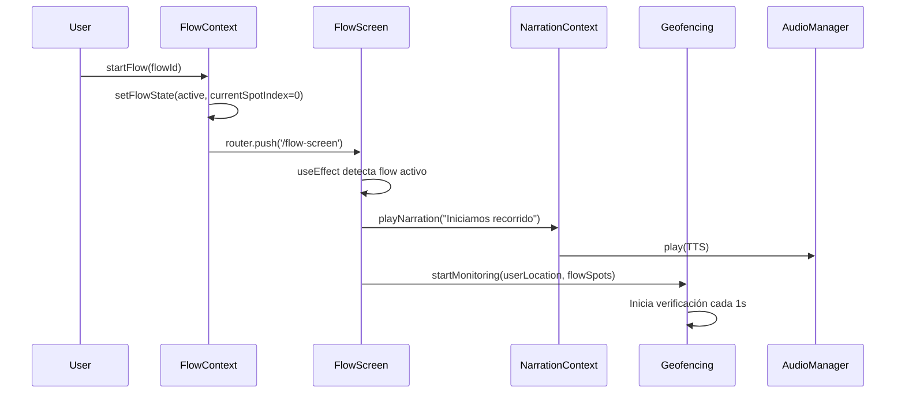
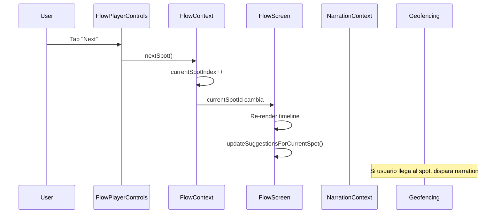
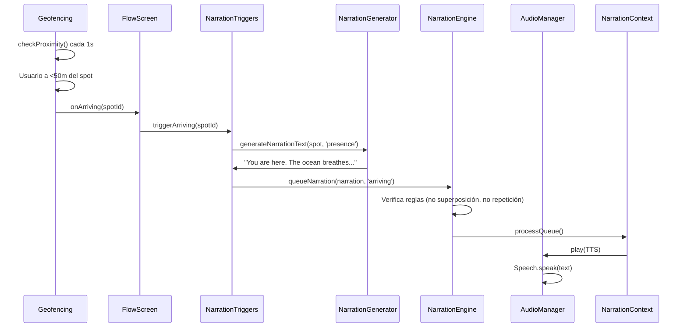
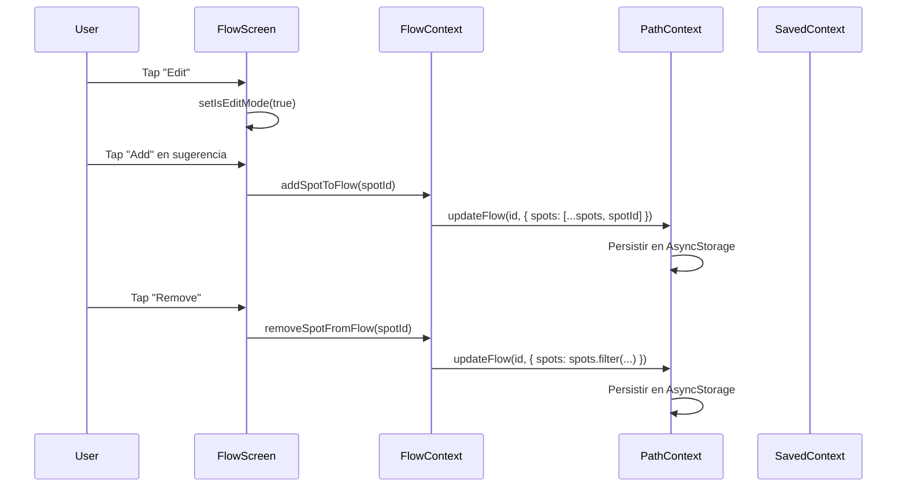
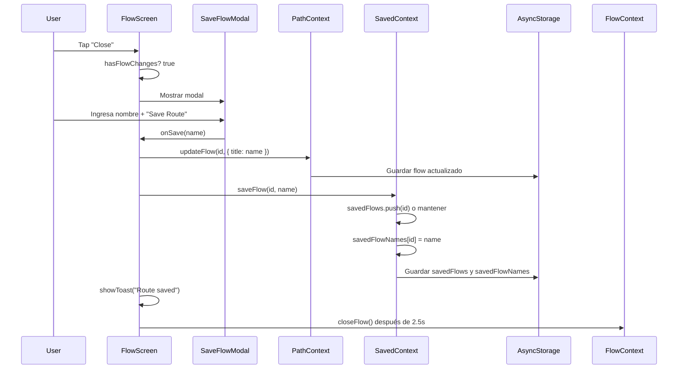

# Análisis Funcional: Flow en FlowScreen

**Fecha:** 2024-12-20  
**Versión:** 1.0  
**Objetivo:** Documentación exhaustiva del comportamiento funcional de Flow en FlowScreen, incluyendo sistema de narración, generación de audio, controles del player, edición de spots, comportamiento del mapa y guardado.

---

## Resumen Ejecutivo

FlowScreen es la pantalla central de la experiencia de navegación en FLOWYA. Permite al usuario seguir un recorrido de spots con narraciones contextuales generadas dinámicamente, controles de reproducción sincronizados, edición en tiempo real del flow, visualización del mapa con ruta y guardado del recorrido.

---

## 1. Estructura General de FlowScreen

### 1.1 Arquitectura de Componentes

**Archivo:** `app/flow-screen.tsx`

FlowScreen se compone de:

1. **ContentHeader** con hero mapa (280px de altura fija)
2. **ScrollView** con timeline de spots
3. **FlowPlayerControls** fijo en la parte inferior
4. **SaveFlowModal** para confirmación de guardado
5. **Toast** para feedback no bloqueante

### 1.2 Estados Principales

```typescript
- flowState: FlowState (status, currentPathId, currentSpotIndex)
- isEditMode: boolean (modo edición de spots)
- isMapFullscreen: boolean (vista fullscreen del mapa)
- showSaveFlowModal: boolean (modal de guardado)
- suggestedSpots: Spot[] (sugerencias dinámicas)
```

### 1.3 Self-Guard de Navegación

FlowScreen implementa un "self-guard" que redirige automáticamente si no hay un flow activo:

```typescript
useEffect(() => {
  const hasNoActiveFlow = !flow || flowState.status === 'idle' || !flowState.currentPathId;
  if (hasNoActiveFlow) {
    router.back() || router.replace('/(tabs)/home');
  }
}, [flow, flowState.status, flowState.currentPathId]);
```

---

## 2. Sistema de Narración

### 2.1 Generación de Narraciones

**Sistema Híbrido de Prioridades:**

Las narraciones se generan usando `generateNarrationText` (`utils/narrationGenerator.ts`) con un sistema de prioridades:

**Prioridad 1: Narración específica del spot**
- Si el spot tiene `spot.narration[type]` (anticipation, presence, transition)
- Se usa directamente sin modificación

**Prioridad 2: Cultural Context**
- Si existe `spot.culturalContext`
- Se adapta según el tipo:
  - **anticipation**: `"As you approach: ${culturalContext}"`
  - **presence**: Se usa directamente
  - **transition**: `"As you leave: ${culturalContext}"`

**Prioridad 3: Description o Why It Matters**
- Si existe `spot.whyItMatters` o `spot.description`
- Se adapta según el tipo:
  - **anticipation**: `"Soon you will be at: ${description}"`
  - **presence**: Se usa directamente
  - **transition**: `"Leaving behind: ${description}"`

**Prioridad 4: Narrativa genérica por tipo**
- Narrativas predefinidas según el tipo de spot (beach, cafe, viewpoint, etc.)

### 2.2 Tipos de Narración

```typescript
type NarrationType = 'anticipation' | 'presence' | 'transition' | 'context';
```

- **anticipation**: Se activa antes de llegar al spot (trigger: `approaching`)
- **presence**: Se activa al llegar al spot (trigger: `arriving`)
- **transition**: Se activa al salir del spot (trigger: `leaving`)
- **context**: Narración contextual entre spots (trigger: `between`)

### 2.3 Triggers de Narración

**En FlowScreen (`app/flow-screen.tsx`):**

```typescript
// Integración con geofencing
useEffect(() => {
  const removeCallbacks = geofencingSimulator.addCallbacks({
    onArriving: (spotId: string) => {
      narrationTriggers.triggerArriving(spotId);
    },
    onApproaching: () => {}, // Desactivado
    onLeaving: () => {},     // Desactivado
  });
  geofencingSimulator.startMonitoring(baseLocation, flowSpots);
}, [flow, flowSpots, baseLocation]);
```

**Trigger de Inicio:**
- Al iniciar el flow, se reproduce una narración de contexto inicial: `"Iniciamos recorrido"`

### 2.4 Generación de Audio

**Sistema Dual (Audio Pre-grabado o TTS):**

**Archivo:** `utils/audioManager.ts`

El audio se genera mediante `narrationToAudioSource`:

```typescript
if (narration.audioUrl) {
  // Audio pre-grabado (expo-av)
  return { type: 'url', source: narration.audioUrl };
} else {
  // Text-to-Speech (expo-speech)
  return {
    type: 'tts',
    source: narration.text,
    language: 'en-US',
    rate: 0.85,   // Velocidad natural
    pitch: 0.95,  // Tono ligeramente más bajo
  };
}
```

**Características:**
- **TTS**: Usa `expo-speech.Speech.speak()` con callbacks `onStart`, `onDone`, `onError`
- **Audio**: Usa `expo-av.Audio.Sound` con eventos de estado
- **Modo audio**: Configurado con `DuckOthers` para permitir mezclar con otras apps (Apple Music, etc.)

### 2.5 Engine de Narración

**Archivo:** `utils/narrationEngine.ts`

**Reglas Duras Implementadas:**

1. **No superposición**: Solo una narración puede reproducirse a la vez
2. **No repetición**: Una narración no se repite en la misma sesión
3. **Respeto de pausas**: Mínimo 3 segundos entre narraciones
4. **Control de velocidad**: Si el usuario se mueve muy rápido (< 10s entre narraciones), solo se permiten narraciones de `presence`

**Sistema de Colas:**
- Las narraciones se encolan por prioridad (presence > anticipation > transition > context)
- Se procesan automáticamente cuando termina la actual

---

## 3. Player y Controles

### 3.1 FlowPlayerControls

**Archivo:** `components/FlowPlayerControls.tsx`

**Variantes:**
- `mini`: Para FlowMiniBar (compacto horizontal)
- `screen`: Para FlowScreen (barra inferior fija)
- `full`: Para FlowFullPlayer (expandido con info)

### 3.2 Controles Disponibles

**Para variant="screen" (FlowScreen):**

1. **Play/Pause** (botón principal):
   - Sincronizado con Flow y Narration
   - Si Flow está `active` → pausa Flow y Narration
   - Si Flow está `paused` → reanuda Flow y Narration

2. **Previous** (opcional):
   - Llama a `previousSpot()` del FlowContext
   - Reduce `currentSpotIndex`

3. **Next**:
   - Llama a `nextSpot()` del FlowContext
   - Incrementa `currentSpotIndex`
   - Deshabilitado si no hay `nextSpotId`

4. **Like / Dislike** (si `showAffinity=true`):
   - `onLike`: Agrega/quita spot de `likedSpotsFromPlayer`
   - `onNotMyVibe`: Marca spot como "not my vibe"

### 3.3 Información Mostrada

**Para variant="screen":**

1. **Status Row:**
   - Indicador visual (punto rojo) + "NOW MOVING"
   - Contador: "X spots added"

2. **Progress Bar:**
   - Barra de progreso visual (0-100%)
   - Calculado: `(currentSpotIndex + 1) / totalSpots * 100`

### 3.4 Sincronización Flow/Narration

```typescript
const handlePause = () => {
  if (flowState.status === 'active') {
    pauseFlow();
    narration.pauseNarration(); // Sincronizado
  } else if (flowState.status === 'paused') {
    resumeFlow();
    narration.resumeNarration(); // Sincronizado
  }
};
```

---

## 4. Edición de Spots en Flow

### 4.1 Modo Edición

**Activación:**
- Botón "edit" en header de "UP NEXT"
- Cambia `isEditMode` entre `true`/`false`

### 4.2 Agregar Spots

**Desde Sugerencias:**

```typescript
// En SpotInlineCard con state="add"
onAdd={() => {
  addSpotToFlow(spot.id);
  setSuggestedSpots(prev => prev.filter(s => s.id !== spot.id));
}}
```

**Comportamiento:**
- `addSpotToFlow` (FlowContext) agrega el spot al final del array `flow.spots`
- Actualiza el Flow en PathContext usando `updateFlow()`
- El spot se agrega automáticamente a la lista "UP NEXT"

**Sistema de Sugerencias:**

**Archivo:** `utils/spotSuggestion.ts`

Las sugerencias se calculan dinámicamente usando `updateSuggestionsForCurrentSpot`:

**Algoritmo de Scoring:**
1. **Proximidad (30%)**: Spots cercanos al spot actual (máx 5km)
2. **Tipo similar (20%)**: Mismo tipo (100pts) o complementario (60pts)
3. **Afinidad (25%)**: Spots guardados (80pts), liked (60pts), en flows guardados (40pts)
4. **Popularidad (15%)**: Spots que aparecen en múltiples flows guardados
5. **Diversidad (10%)**: Penaliza repetir tipos ya en el flow

### 4.3 Remover Spots

```typescript
const handleRemoveSpot = (spotId: string) => {
  removeSpotFromFlow(spotId);
  
  // Si es flow desde spot, agregar a sugerencias
  if (isFromSpot && spot) {
    setSuggestedSpots(prev => [...prev, spot]);
  }
  
  showToast(`Spot "${spot?.name}" removed`, 'info', 'close', () => {
    // Undo: agregar de vuelta
    addSpotToFlow(spotId);
  });
};
```

**Restricciones:**
- No se puede remover el spot actual
- No se pueden remover spots pasados
- Solo spots futuros pueden removerse

### 4.4 Reordenar Spots

```typescript
const handleMoveUp = (spotId: string) => {
  const spotIndex = flow.spots.indexOf(spotId);
  if (spotIndex <= flowState.currentSpotIndex + 1) return;
  
  const newOrder = [...flow.spots];
  [newOrder[spotIndex - 1], newOrder[spotIndex]] = [newOrder[spotIndex], newOrder[spotIndex - 1]];
  reorderFlowSpots(newOrder);
};

const handleMoveDown = (spotId: string) => {
  const spotIndex = flow.spots.indexOf(spotId);
  if (spotIndex >= flow.spots.length - 1) return;
  
  const newOrder = [...flow.spots];
  [newOrder[spotIndex], newOrder[spotIndex + 1]] = [newOrder[spotIndex + 1], newOrder[spotIndex]];
  reorderFlowSpots(newOrder);
};
```

**Restricciones:**
- No se puede mover arriba del spot siguiente (actual + 1)
- No se puede mover el último spot hacia abajo

---

## 5. Comportamiento del Mapa

### 5.1 Visualización del Mapa

**Componente:** `FlowyaMapView` (wrapper de MapboxView)

**Props relevantes:**
- `spots={flowSpots}`: Todos los spots del flow
- `showRoute={true}`: Muestra ruta entre spots (Polyline)
- `flowSpots={flowSpots}`: Spots para la ruta
- `showUserLocation={!!baseLocation}`: Muestra ubicación del usuario
- `routeFrom={baseLocation}`: Origen de la ruta (usuario)
- `routeTo={targetSpot.location}`: Destino (spot actual o primero)
- `currentSpotIndex={flowState.currentSpotIndex}`: Índice del spot actual
- `flowSpotsOrder={flowSpots}`: Orden de spots para pines numerados

### 5.2 Región Inicial

El mapa calcula automáticamente la región inicial para incluir:
- Ubicación del usuario (si está disponible)
- Todos los spots del flow

```typescript
const calculateMapRegion = () => {
  const allPoints = [];
  if (baseLocation) allPoints.push(baseLocation);
  flowSpots.forEach(spot => allPoints.push(spot.location));
  
  // Calcular centro y deltas para incluir todos los puntos
  // Con padding de 1.5x para mejor visualización
};
```

### 5.3 Controles del Mapa

**Controles en esquina inferior izquierda:**

1. **Get Directions** (botón principal):
   - Calcula ruta desde ubicación del usuario al spot destino
   - Abre app de navegación externa (Google Maps / Apple Maps)
   - Usa `movementMode` del flow para determinar modo de transporte

2. **Fullscreen Toggle**:
   - Cambia `isMapFullscreen` entre `true`/`false`
   - En fullscreen: mapa ocupa 100% del viewport
   - En modo normal: mapa embebido en ScrollView (280px altura)

### 5.4 Interacción con Markers

**Al tocar un marker:**
- Navega a `SpotDetail` del spot seleccionado
- No cambia el spot actual del flow

---

## 6. Guardado del Flow

### 6.1 Estados del Flow

**Archivo:** `utils/flowChanges.ts`

El sistema reconoce 3 estados canónicos:

1. **draft**: Flow nunca guardado (no está en `savedFlows`)
2. **saved**: Flow ya guardado sin cambios pendientes
3. **edited**: Flow previamente guardado con cambios sin guardar

### 6.2 Detección de Cambios

**Archivo:** `utils/flowChanges.ts` - `hasFlowChanges()`

Compara:
- `flow.spots` vs `savedFlow.spots` (orden importa)
- `flow.title` vs `savedFlow.title`
- `flow.description` vs `savedFlow.description`
- `flow.movementMode` vs `savedFlow.movementMode`

### 6.3 Flujo de Guardado

**Cuando el usuario cierra el flow:**

```typescript
const handleClose = () => {
  if (!flowHasChanges) {
    // Sin cambios: cerrar directamente
    closeFlow(narration.stopNarration);
  } else {
    // Con cambios: mostrar modal de confirmación
    setShowSaveFlowModal(true);
  }
};
```

**Modal de Guardado (`SaveFlowModal`):**

**Para draft con cambios:**
- Muestra input de nombre
- Botones: "Save Route" (primary) + "Exit without saving" (secondary)

**Para edited flow:**
- Muestra mensaje de confirmación
- Botones: "Save Changes" (primary) + "Discard Changes" (secondary)

**Para saved sin cambios:**
- Muestra nombre actual (read-only)
- Botón: "Close" (primary)

### 6.4 Proceso de Guardado

**Archivo:** `app/flow-screen.tsx` - `handleSaveFlowWithName()`

```typescript
// Step 1: Cerrar modal
setShowSaveFlowModal(false);

// Step 2: Actualizar título del Flow en PathContext
updateFlow(flow.id, { title: name });

// Step 3: Guardar en SavedContext
saveFlow(flow.id, name);

// Step 4: Mostrar toast de éxito
showToast(wasSavedBefore ? 'Route updated' : 'Route saved', 'success');

// Step 5: Cerrar flow después de 2.5s (para ver toast)
setTimeout(() => closeFlow(narration.stopNarration), 2500);
```

### 6.5 Persistencia

**PathContext (`contexts/PathContext.tsx`):**
- Los flows se guardan en `AsyncStorage` con key `@flowya_flows`
- Se actualizan automáticamente cuando cambia el array `flows`

**SavedContext (`contexts/SavedContext.tsx`):**
- Los IDs de flows guardados se guardan en `AsyncStorage` con key `@flowya_saved`
- Los nombres personalizados se guardan en `savedFlowNames: Record<string, string>`
- Se sincroniza automáticamente cuando cambia `data`

**saveFlow (canónico):**
```typescript
// Create if draft, Update if saved
const saveFlow = (flowId: string, customName: string) => {
  const isSaved = prev.savedFlows.includes(flowId);
  const newSavedFlows = isSaved
    ? prev.savedFlows // Update: mantener
    : [...prev.savedFlows, flowId]; // Create: agregar
  
  // Siempre actualizar el nombre personalizado
  newSavedFlowNames[flowId] = customName;
  
  // Agregar a timeline solo si es creación (no update)
  if (!isSaved) {
    addToTimeline('path', 'saved', flowId);
  }
};
```

---

## 7. Timeline y Visualización de Spots

### 7.1 Estructura del Timeline

**Secciones:**

1. **Spot Actual (ACTIVE)**:
   - Se muestra con `SpotInlineCard` con `state="active"`
   - Indicador visual (punto destacado)
   - Distancia desde ubicación del usuario
   - Toca → navega a `SpotDetail`

2. **UP NEXT**:
   - Header con botón de edición
   - Lista de spots futuros con `state="next"`
   - Números de orden (2, 3, 4, etc.)
   - En modo edición: controles de remover y reordenar

3. **More Suggestions** (solo si `isFromSpot=true`):
   - Aparece dentro de "UP NEXT" si hay sugerencias
   - Separado visualmente con borde superior
   - Spots con `state="add"` y botón de agregar

### 7.2 Cálculo de Progreso

```typescript
const progress = totalSpots > 0 
  ? Math.round((currentSpotIndex / totalSpots) * 100) 
  : 0;
```

**Ejemplo:** Si hay 5 spots y currentSpotIndex=2 (tercer spot), progress=40%

---

## 8. Integración con Geofencing

### 8.1 Geofencing Simulado

**Archivo:** `utils/geofencingSimulator.ts`

**Distancias:**
- `APPROACHING_DISTANCE`: 500m
- `ARRIVING_DISTANCE`: 50m
- `LEAVING_DISTANCE`: 100m

**Monitoreo:**
- Verifica proximidad cada segundo
- Dispara eventos cuando el usuario cruza umbrales
- Solo dispara `onArriving` en FlowScreen (approaching y leaving desactivados)

### 8.2 Trigger de Narración al Llegar

```typescript
geofencingSimulator.addCallbacks({
  onArriving: (spotId: string) => {
    narrationTriggers.triggerArriving(spotId);
  }
});
```

**Flujo:**
1. Usuario llega a 50m del spot
2. `geofencingSimulator` dispara `onArriving(spotId)`
3. `triggerArriving` genera texto de narración (`generateNarrationText`)
4. Crea objeto `Narration` con id único y duración estimada
5. Encola en `narrationEngine` con trigger `'arriving'`
6. Si no hay narración reproduciéndose, se procesa inmediatamente
7. Se reproduce usando TTS o audio pre-grabado

---

## 9. Flujo Completo del Usuario

### 9.1 Inicio del Flow



### 9.2 Navegación entre Spots



### 9.3 Llegada a Spot (Geofencing)



### 9.4 Edición de Flow



### 9.5 Guardado del Flow



---

## 10. Archivos Relacionados

### 10.1 Pantallas
- `app/flow-screen.tsx` - Pantalla principal del flow
- `app/flow-full-player.tsx` - Vista expandida del player

### 10.2 Componentes
- `components/FlowPlayerControls.tsx` - Controles de reproducción
- `components/SaveFlowModal.tsx` - Modal de confirmación de guardado
- `components/SpotInlineCard.tsx` - Card de spot en timeline
- `components/NarrationController.tsx` - Orquestador de narraciones

### 10.3 Contextos
- `contexts/FlowContext.tsx` - Estado del flow activo
- `contexts/NarrationContext.tsx` - Estado de narraciones
- `contexts/PathContext.tsx` - Gestión de flows (persistencia)
- `contexts/SavedContext.tsx` - Flows guardados y nombres personalizados

### 10.4 Utils
- `utils/narrationGenerator.ts` - Generación de texto de narraciones
- `utils/narrationEngine.ts` - Engine de colas y reglas de narración
- `utils/audioManager.ts` - Gestión de audio (TTS y pre-grabado)
- `utils/geofencingSimulator.ts` - Simulación de proximidad
- `utils/spotSuggestion.ts` - Algoritmo de sugerencias
- `utils/flowChanges.ts` - Detección de cambios y estados

### 10.5 Componentes de Mapa
- `components/MapView.tsx` - Wrapper de FlowyaMapView
- `components/MapboxView.tsx` - Implementación móvil
- `components/MapboxViewWeb.tsx` - Implementación web

---

## 11. Comportamientos Especiales

### 11.1 Flow desde Spot (`isFromSpot`)

**Detección:**
- Título contiene "Flow from"
- Descripción contiene "We'll build the path as you move"
- Metadata indica origen desde spot

**Comportamiento:**
- Muestra sección "More Suggestions" con spots sugeridos
- Al remover spot, se agrega automáticamente a sugerencias
- Las sugerencias se actualizan dinámicamente según el spot actual

### 11.2 Modo Fullscreen del Mapa

**Activación:**
- Botón "fullscreen" en controles del mapa
- Cambia `isMapFullscreen` a `true`

**Comportamiento:**
- Mapa ocupa 100% del viewport
- Header se simplifica (solo botones esenciales)
- Timeline y controles se ocultan
- Botón "fullscreen-exit" para volver al modo normal

### 11.3 Minimizar Flow

**Handler:**
```typescript
const handleMinimize = () => {
  minimizeFlow();
  router.back() || router.replace('/(tabs)/home');
};
```

**Comportamiento:**
- El flow permanece activo (`status: 'active'`)
- Se marca como `isMinimized: true`
- FlowMiniBar se muestra en la parte inferior
- Usuario puede expandir desde cualquier pantalla

---

## 12. Resumen de Funcionalidades

### 12.1 Sistema de Narración
- Generación dinámica con sistema de prioridades
- Text-to-Speech y audio pre-grabado
- Triggers automáticos por geofencing
- Reglas duras (no superposición, no repetición, control de velocidad)
- Sistema de colas con prioridades

### 12.2 Controles del Player
- Play/Pause sincronizado con Flow y Narration
- Navegación Previous/Next
- Like/Dislike de spots
- Barra de progreso visual
- Estado "NOW MOVING" con contador

### 12.3 Edición de Flow
- Agregar spots desde sugerencias
- Remover spots futuros (con undo)
- Reordenar spots (move up/down)
- Modo edición con controles visuales

### 12.4 Mapa
- Visualización de ruta punto a punto
- Marcadores numerados por orden
- Controles: Get directions, Fullscreen toggle
- Cálculo automático de región inicial

### 12.5 Guardado
- Detección automática de cambios
- Modal contextual según estado (draft/saved/edited)
- Persistencia en AsyncStorage (PathContext + SavedContext)
- Nombres personalizados guardados por flow

---

**Documento generado:** 2024-12-20  
**Versión del Proyecto:** FLOWYA V1.0  
**Última actualización:** Análisis funcional completo de Flow en FlowScreen