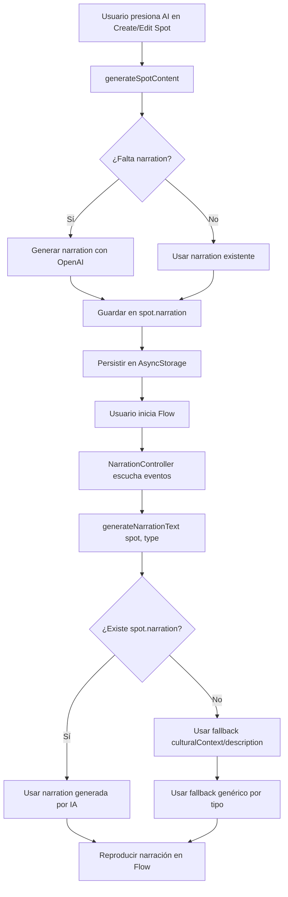

# Análisis de Integración: Narraciones Generadas por IA con Sistema de Flow

**Fecha:** 2024-12-20  
**Versión:** 1.0  
**Objetivo:** Documentar el flujo completo desde generación de narraciones hasta uso en Flow

---

## 1. Flujo Completo de Narraciones

### 1.1. Generación de Narraciones

**Ubicación:** `utils/aiContentGenerator.ts`

**Proceso:**
1. Usuario presiona botón "AI" en creación o edición de spot
2. `generateSpotContent()` detecta que falta `narration`
3. Se genera prompt específico para narraciones
4. OpenAI API genera objeto `narration` con:
   - `anticipation`: Texto para cuando se acerca al spot
   - `presence`: Texto para cuando llega al spot
   - `transition`: Texto para cuando se va del spot
5. Narración se guarda en `spot.narration`

**Formato generado:**
```typescript
{
  anticipation: "Mientras te acercas, siente cómo la historia antigua se mezcla con el viento del mar.",
  presence: "Estás aquí, en un lugar donde el tiempo parece detenerse y la contemplación es inevitable.",
  transition: "Al partir, lleva contigo la sensación de haber estado en un espacio sagrado."
}
```

### 1.2. Guardado de Narraciones

**Ubicación:** `contexts/SpotContext.tsx` (línea 154)

**Proceso:**
- Cuando se genera contenido con IA, `narration` se guarda automáticamente en el spot
- Se persiste en AsyncStorage junto con el resto del spot
- Campo `aiGenerated` marca que el contenido fue generado por IA

**Código:**
```typescript
updateSpot(spotId, {
  narration: generatedContent.narration || spot.narration,
  aiGenerated: generatedContent.aiGenerated || spot.aiGenerated,
});
```

### 1.3. Uso en Flow

**Ubicación:** `utils/narrationGenerator.ts`

**Sistema de Prioridades:**
1. **Prioridad 1:** `spot.narration[type]` - Narración específica generada por IA
2. **Prioridad 2:** `spot.culturalContext` - Adaptado al tipo de narración
3. **Prioridad 3:** `spot.whyItMatters` o `spot.description` - Adaptado al tipo
4. **Prioridad 4:** Narración genérica por tipo de spot

**Función:** `generateNarrationText(spot, narrationType)`

**Integración:**
- `NarrationController.tsx` usa `generateNarrationText()` para obtener texto
- Si `spot.narration` existe, se usa directamente (prioridad 1)
- Si no existe, se usa fallback según prioridades

---

## 2. Estado Actual de la Integración

### 2.1. ✅ Funcionalidades Completas

1. **Generación:** Las narraciones se generan correctamente con OpenAI
2. **Guardado:** Se guardan en el spot y se persisten
3. **Sistema de Prioridades:** `narrationGenerator.ts` ya tiene lógica para usar narraciones del spot
4. **Integración con Flow:** `NarrationController` usa `generateNarrationText()` que prioriza `spot.narration`

### 2.2. ⚠️ Consideraciones

1. **Narraciones no visibles en UI:** Por diseño, las narraciones no se muestran en creación/edición (solo se generan)
2. **Formato correcto:** Las narraciones generadas siguen el formato esperado por `NarrationContext`
3. **Fallback robusto:** Si la generación falla, el sistema usa fallbacks automáticos

---

## 3. Flujo de Datos Completo



---

## 4. Validación de Integración

### 4.1. Verificación de Formato

**Formato esperado por NarrationContext:**
```typescript
{
  anticipation?: string;
  presence?: string;
  transition?: string;
}
```

**Formato generado por OpenAI:**
- ✅ Coincide exactamente con el formato esperado
- ✅ Se guarda correctamente en `spot.narration`
- ✅ Se lee correctamente en `generateNarrationText()`

### 4.2. Verificación de Flujo

1. **Generación → Guardado:**
   - ✅ `generateSpotContent()` genera `narration`
   - ✅ `SpotContext.updateSpot()` guarda `narration`
   - ✅ Se persiste en AsyncStorage

2. **Guardado → Uso en Flow:**
   - ✅ `generateNarrationText()` lee `spot.narration`
   - ✅ Prioriza `spot.narration[type]` sobre fallbacks
   - ✅ `NarrationController` usa `generateNarrationText()`

---

## 5. Conclusión

### Estado Actual
✅ **La integración está completa y funcional**

- Las narraciones se generan correctamente
- Se guardan en el spot
- Se usan en Flow con prioridad sobre fallbacks
- El sistema es robusto con múltiples niveles de fallback

### No se Requieren Cambios
El sistema actual ya está preparado para usar narraciones generadas por IA. No se requieren cambios adicionales en este momento.

### Notas
- Las narraciones generadas son invisibles al usuario durante creación/edición (por diseño)
- El sistema de fallbacks asegura que siempre haya narración disponible
- Las narraciones se generan en español (según configuración actual)

---

**Documento generado:** 2024-12-20  
**Versión del Proyecto:** FLOWYA V1.0  
**Última actualización:** Análisis de integración de narraciones generadas por IA con sistema de Flow
